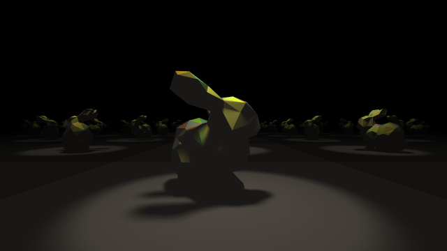
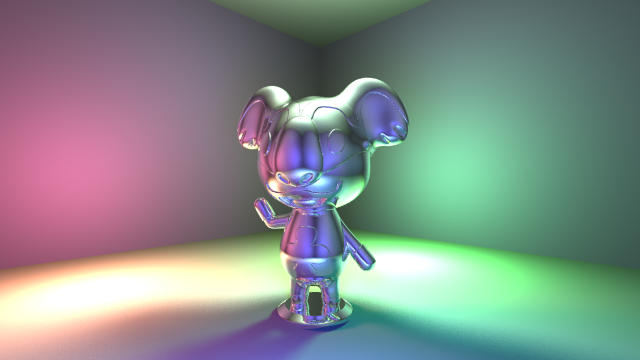

Ray tracer written in golang.




# Usage

## Code
```
    cameraLookFrom := r3.Vec{X: 0, Y: 0, Z: -8}
    cameraLookAt := r3.Vec{X: 0, Y: 0, Z: 0}
    cameraUp := r3.Vec{X: 0, Y: 1, Z: 0}
    cameraFocusPoint := cameraLookAt
    shapes := []raytracer.Shape{
        &raytracer.Sphere{
            Center: r3.Vec{X: 0, Y: 0, Z: 0},
            Radius: 2,
            Mat: raytracer.PhongBlinn{
                SpecHardness:  1,
                SpecularColor: r3.Vec{X: 1, Y: 1, Z: 1},
                Color:         r3.Vec{X: 1, Y: 0, Z: 0},
            },
        },
    }
    lights := []raytracer.Light{
		raytracer.AmbientLight{
			ColorFrac: r3.Vec{
				X: 1,
				Y: 1,
				Z: 1,
			},
			LightIntensity: 0.5,
		},
        raytracer.PointLight{
            ColorFrac: r3.Vec{
                X: 255 / 255.0,
                Y: 255 / 255.0,
                Z: 255 / 255.0,
            },
			LightIntensity:         1,
			SpecularLightIntensity: 10,
            Position: r3.Vec{
                X: 3,
                Y: 3,
                Z: -3,
            },
        },
    }
    imageSpec := raytracer.ImageSpec{
        Width:                           imageWidth,
        Height:                          imageHeight,
        AntiAliasingFactor:              antiAliasingFactor,
        CameraAperature:                 cameraAperature,
        CameraFov:                       cameraFovDegrees,
        RayTracingMaxDepth:              raytracingMaxDepth,
        SoftShadowMonteCarloRepetitions: softShadowMonteCarloRepetitions,

        CameraLookFrom:                  cameraLookFrom,
        CameraLookAt:                    cameraLookAt,
        CameraUp:                        cameraUp,
        CameraFocusPoint:                cameraFocusPoint,

        ImageLocation:                   "out.png",
    }
    raytracer.GenerateImage(imageSpec, shapes, lights)
```

## Command
```shell
go build -o raytracer-go
./raytracer-go

open ./out.png
```

# Shapes

* Sphere
* Triangle plane

# Lighting

* Ambient
* Point
* Spot

# Materials

* Standard
* Metal
* Dielectric
* Phong-Blinn

# Features

* Acceleration structures (bounding volume hierarchy)
* Anti-Aliasing
* Camera FOV
* Camera Lens blur (aperature)
* Inverse square law decay for non-ambient lights
* Soft Shadows (Monte Carlo)
* Transformations (translate, scale, rotate)

# STL Models used in samples

* [LOW POLY STANFORD BUNNY](https://cults3d.com/en/3d-model/art/low-poly-stanford-bunny) - Author: Istareyn - LICENSE: https://creativecommons.org/licenses/by-nc/3.0/ - no changes to STL file were made
* [LYMAN FROM ANIMAL CROSSING](https://cults3d.com/en/3d-model/art/lyman-from-animal-crossing) - Author: Philin_theBlank - LICENSE: https://creativecommons.org/licenses/by-nc/3.0/ - no changes to STL file were made