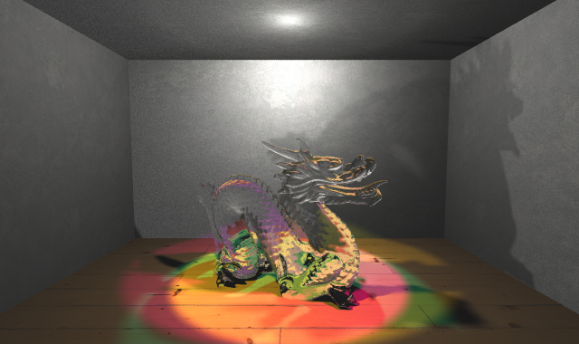
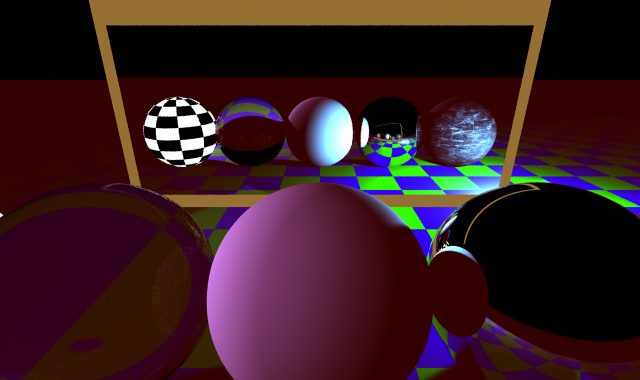

Ray tracer written in golang.



# Usage

See [Code Example](#code-example) for sample code.

```shell
go build -o raytracer-go
./raytracer-go

open ./out.png
```



# Shapes

* Sphere
* Triangle plane

# Lighting

* Ambient
* Point
* Spot

# Materials

* Standard
* Metal
* Dielectric
* Phong-Blinn

# Features

* Acceleration structures (bounding volume hierarchy)
* Anti-Aliasing
* Camera FOV
* Camera Lens blur (aperature)
* Inverse square law decay for non-ambient lights
* Soft Shadows (Monte Carlo)
* Texture Mapping
* Transformations (translate, scale, rotate)

# Textures

All textures are from [ambientcg.com](https://ambientcg.com/) - LICENSE: https://creativecommons.org/publicdomain/zero/1.0/

# STL Models used in samples

* [The Stanford 3D Scanning Repository
  ](http://graphics.stanford.edu/data/3Dscanrep/) - Credit: Stanford Computer Graphics Laboratory

# Code Example

```
    imageLocation := "out.png"

    floorRadius := 100.0
    centerPiecesRadius := 2.0
    backMirrorRadius := 4 * centerPiecesRadius
    backMirrorBorder := centerPiecesRadius / 2

    cameraLookFrom := r3.Vec{X: 0, Y: 3 * centerPiecesRadius, Z: -5}
    cameraLookAt := r3.Vec{X: 0, Y: 2 * centerPiecesRadius, Z: 0}
    cameraUp := r3.Vec{X: 0, Y: 1, Z: 0}
    cameraFocusPoint := cameraLookAt
    cameraAperature := 0.015
    cameraFovDegrees := 60.0

    texturePlane := raytracer.CheckersTexture{
        ColorFrac1:     r3.Vec{ X: 0, Y: 1, Z: 0 },
        ColorFrac2:     r3.Vec{ X: 0, Y: 0, Z: 1 },
        CheckersWidth:  100.0,
        CheckersHeight: 100.0,
    }
    textureLeftSphere := raytracer.CheckersTexture{
        ColorFrac1:     r3.Vec{ X: 0, Y: 0, Z: 0 },
        ColorFrac2:     r3.Vec{ X: 1, Y: 1, Z: 1 },
        CheckersWidth:  10.0,
        CheckersHeight: 10.0,
    }
    textureRightSphereFileName := "samples_textures/Tiles075_1K_Color.jpg"
    textureRightSphereFile, err := os.Open(textureRightSphereFileName)
    if err != nil {
        panic(err)
    }
    defer textureRightSphereFile.Close()

    textureRightSphereTexture, err := raytracer.LoadRGBAImage(textureRightSphereFile)
    if err != nil {
        panic(err)
    }
    textureRightSphere := raytracer.ImageTexture{
        Img: textureRightSphereTexture,
    }

    shapes := []raytracer.Shape{
        // centerpieces
        &raytracer.Sphere{
            Center: r3.Vec{X: 4 * centerPiecesRadius, Y: centerPiecesRadius, Z: 0},
            Radius: centerPiecesRadius,
            Mat: raytracer.Standard{
                Texture: textureLeftSphere,
            },
        },
        &raytracer.Sphere{
            Center: r3.Vec{X: 2 * centerPiecesRadius, Y: centerPiecesRadius, Z: 0},
            Radius: centerPiecesRadius,
            Mat: raytracer.Dielectric{
                RefractiveIndex: 1.52,
            },
        },
        &raytracer.Sphere{
            Center: r3.Vec{X: 0, Y: centerPiecesRadius, Z: 0},
            Radius: centerPiecesRadius,
            Mat: raytracer.PhongBlinn{
                SpecHardness:      1,
                SpecularColorFrac: r3.Vec{X: 1, Y: 1, Z: 1},
                ColorFrac:         r3.Vec{X: 1, Y: 1, Z: 1},
            },
        },
        &raytracer.Sphere{
            Center: r3.Vec{X: -2 * centerPiecesRadius, Y: centerPiecesRadius, Z: 0},
            Radius: centerPiecesRadius,
            Mat: raytracer.Metal{
                Albedo: r3.Vec{X: 1.0, Y: 1.0, Z: 1.0},
                Fuzz:   0,
            },
        },
        &raytracer.Sphere{
            Center: r3.Vec{X: -4 * centerPiecesRadius, Y: centerPiecesRadius, Z: 0},
            Radius: centerPiecesRadius,
            Mat: raytracer.PhongBlinn{
                SpecHardness:      1,
                SpecularColorFrac: r3.Vec{X: 1, Y: 1, Z: 1},
                Texture: textureRightSphere,
            },
        },

        // floor
        &raytracer.TrianglePlane{
            PointA:      r3.Vec{X: -floorRadius, Y: 0, Z: -floorRadius},
            PointB:      r3.Vec{X: -floorRadius, Y: 0, Z: floorRadius},
            PointC:      r3.Vec{X: floorRadius, Y: 0, Z: -floorRadius},
            SingleSided: true,
            Mat: raytracer.PhongBlinn{
                ColorFrac:         r3.Vec{X: 0, Y: 0, Z: 0},
                SpecularColorFrac: r3.Vec{X: 1, Y: 1, Z: 1},
                SpecHardness:      1,
                Texture:           texturePlane,
            },
        },
        &raytracer.TrianglePlane{
            PointA:      r3.Vec{X: floorRadius, Y: 0, Z: floorRadius},
            PointB:      r3.Vec{X: floorRadius, Y: 0, Z: -floorRadius},
            PointC:      r3.Vec{X: -floorRadius, Y: 0, Z: floorRadius},
            SingleSided: true,
            Mat: raytracer.PhongBlinn{
                ColorFrac:         r3.Vec{X: 0, Y: 0, Z: 0},
                SpecularColorFrac: r3.Vec{X: 1, Y: 1, Z: 1},
                SpecHardness:      1,
                Texture:           texturePlane,
            },
        },

        // back mirror
        &raytracer.TrianglePlane{
            PointA:      r3.Vec{X: backMirrorRadius, Y: backMirrorRadius, Z: backMirrorRadius},
            PointB:      r3.Vec{X: backMirrorRadius, Y: 0, Z: backMirrorRadius},
            PointC:      r3.Vec{X: -backMirrorRadius, Y: backMirrorRadius, Z: backMirrorRadius},
            SingleSided: true,
            Mat: raytracer.Standard{
                ColorFrac: r3.Vec{X: 150 / 255.0, Y: 111 / 255.0, Z: 51 / 255.0},
            },
        },
        &raytracer.TrianglePlane{
            PointA:      r3.Vec{X: -backMirrorRadius, Y: 0, Z: backMirrorRadius},
            PointB:      r3.Vec{X: -backMirrorRadius, Y: backMirrorRadius, Z: backMirrorRadius},
            PointC:      r3.Vec{X: backMirrorRadius, Y: 0, Z: backMirrorRadius},
            SingleSided: true,
            Mat: raytracer.Standard{
                ColorFrac: r3.Vec{X: 150 / 255.0, Y: 111 / 255.0, Z: 51 / 255.0},
            },
        },
        &raytracer.TrianglePlane{
            PointA:      r3.Vec{X: backMirrorRadius - backMirrorBorder, Y: backMirrorRadius - backMirrorBorder, Z: backMirrorRadius - backMirrorBorder},
            PointB:      r3.Vec{X: backMirrorRadius - backMirrorBorder, Y: backMirrorBorder, Z: backMirrorRadius - backMirrorBorder},
            PointC:      r3.Vec{X: -(backMirrorRadius - backMirrorBorder), Y: backMirrorRadius - backMirrorBorder, Z: backMirrorRadius - backMirrorBorder},
            SingleSided: true,
            Mat: raytracer.Metal{
                Albedo: r3.Vec{X: 1, Y: 1, Z: 1},
                Fuzz:   0,
            },
        },
        &raytracer.TrianglePlane{
            PointA:      r3.Vec{X: -(backMirrorRadius - backMirrorBorder), Y: backMirrorBorder, Z: backMirrorRadius - backMirrorBorder},
            PointB:      r3.Vec{X: -(backMirrorRadius - backMirrorBorder), Y: backMirrorRadius - backMirrorBorder, Z: backMirrorRadius - backMirrorBorder},
            PointC:      r3.Vec{X: backMirrorRadius - backMirrorBorder, Y: backMirrorBorder, Z: backMirrorRadius - backMirrorBorder},
            SingleSided: true,
            Mat: raytracer.Metal{
                Albedo: r3.Vec{X: 1, Y: 1, Z: 1},
                Fuzz:   0,
            },
        },
    }
    lights := []raytracer.Light{
        raytracer.AmbientLight{
            ColorFrac: r3.Vec{
                X: 255 / 255.0,
                Y: 0 / 255.0,
                Z: 0 / 255.0,
            },
            LightIntensity: 0.2,
        },
        raytracer.SpotLight{
            ColorFrac: r3.Vec{
                X: 171 / 255.0,
                Y: 137 / 255.0,
                Z: 255 / 255.0,
            },
            LightIntensity:         100,
            SpecularLightIntensity: 100,
            Position: r3.Vec{
                X: 6 * centerPiecesRadius,
                Y: 5 * centerPiecesRadius,
                Z: -3 * centerPiecesRadius,
            },
            LookAt: r3.Vec{
                X: 0,
                Y: 0,
                Z: 0,
            },
            Angle:                       30,
            InverseSquareLawDecayFactor: 1.0,
        },
        raytracer.PointLight{
            ColorFrac: r3.Vec{
                X: 67 / 255.0,
                Y: 163 / 255.0,
                Z: 241 / 255.0,
            },
            LightIntensity:         100,
            SpecularLightIntensity: 10,
            Position: r3.Vec{
                X: -4 * centerPiecesRadius,
                Y: centerPiecesRadius,
                Z: 3 * centerPiecesRadius,
            },
            InverseSquareLawDecayFactor: 0.5,
        },
    }
    imageSpec := raytracer.ImageSpec{
        Width:                           640,
        Height:                          380,
        AntiAliasingFactor:              32,
        RayTracingMaxDepth:              16,
        SoftShadowMonteCarloRepetitions: 16,
        WorkerCount:                     16,
        BvhTraversalAlgorithm:           raytracer.Dijkstra,
    }
    scene := raytracer.Scene{
        CameraLookFrom:   cameraLookFrom,
        CameraLookAt:     cameraLookAt,
        CameraUp:         cameraUp,
        CameraFocusPoint: cameraFocusPoint,
        CameraAperature:  cameraAperature,
        CameraFov:        cameraFovDegrees,
        Shapes:           shapes,
        Lights:           lights,
    }
    myImage := raytracer.GenerateImage(imageSpec, scene)

    outputFile, err := os.Create(imageLocation)
    if err != nil {
        panic("failed to create image")
    }
    defer outputFile.Close()
    png.Encode(outputFile, myImage)
```